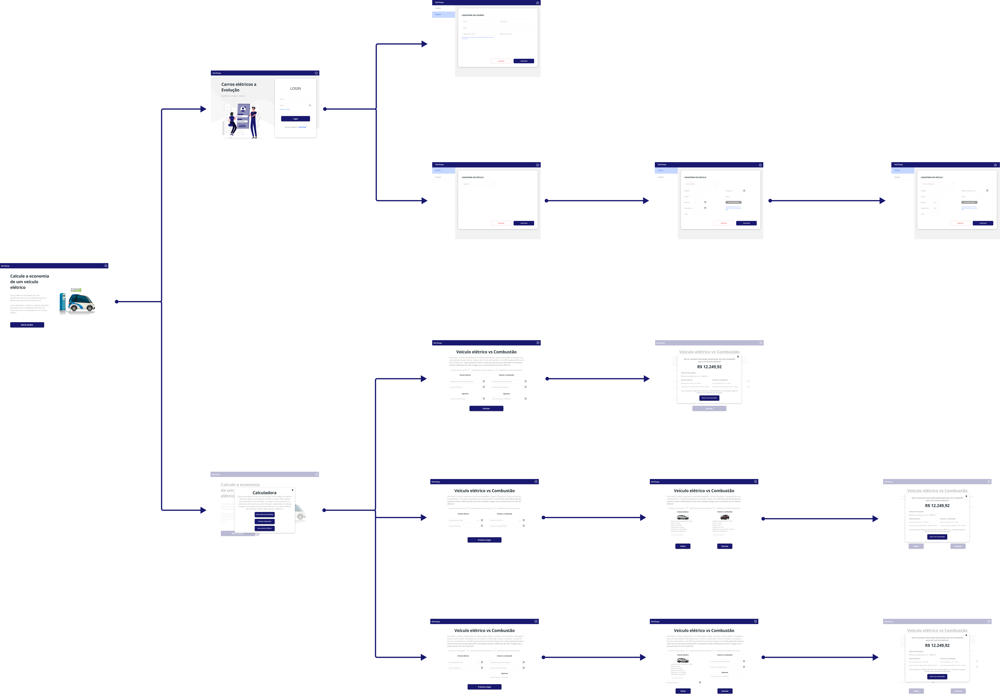
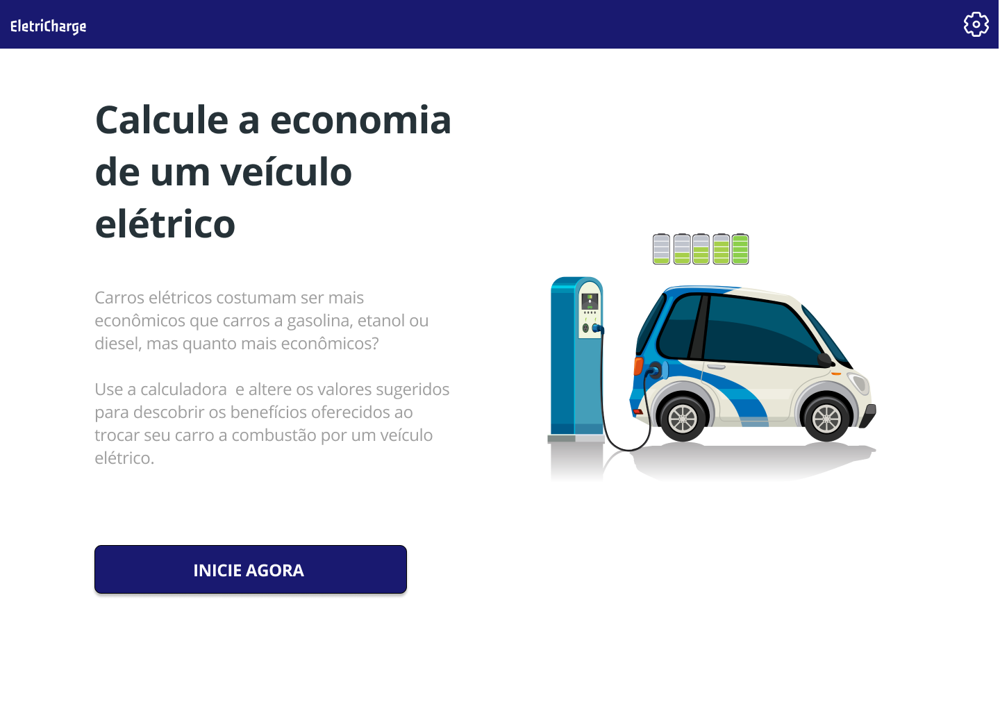
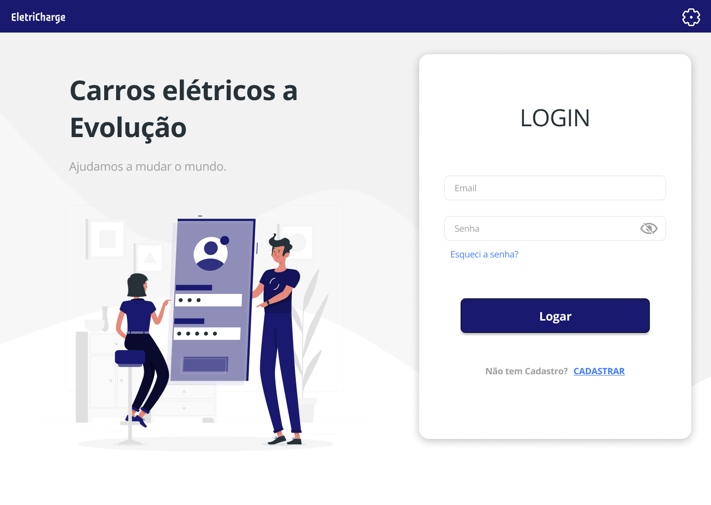
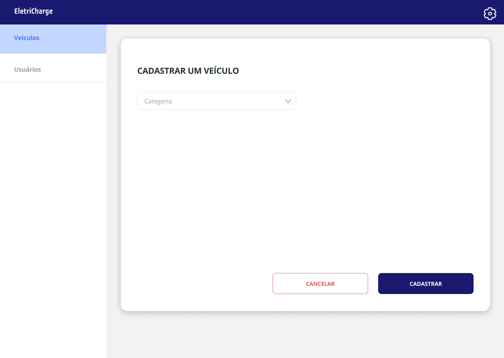
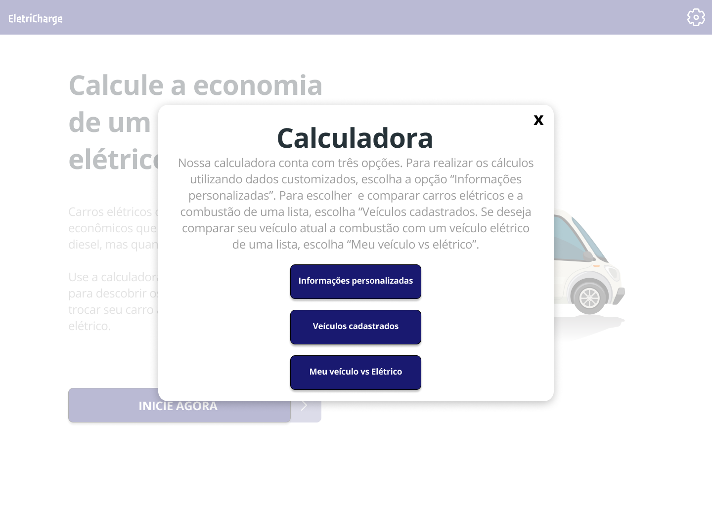
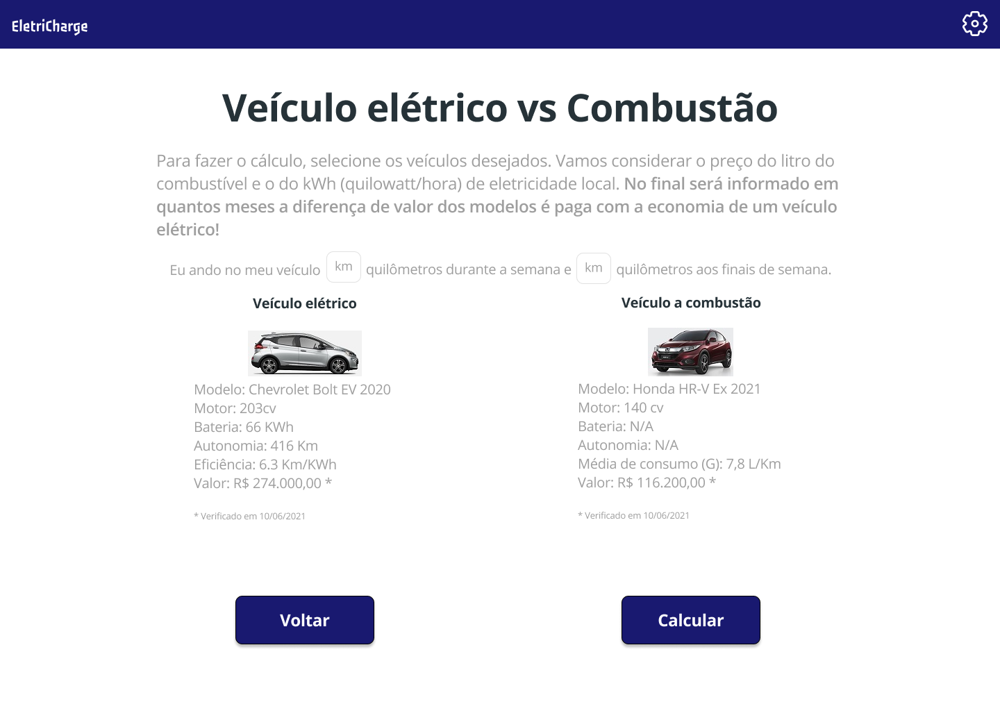

# Projeto de Interface

Visão geral da interação do usuário pelas telas do sistema e protótipo interativo das telas com as funcionalidades que fazem parte do sistema (wireframes).

## User Flow

A partir da tela de ínicio (home) da aplicação, o usuário poderá seguir para a página de login ao clicar no ícone de engrenagem e, assim, logar no sistema ou efetuar o seu cadastro. Caso contrário, ao clicar no botão "INICIE AGORA", o usuário encontrará um "modal" contendo as opções fornecidas pela calculadora. Na primeira opção o usuário poderá inserir os dados de ambos os carros (elétrico e a bombustão) fazendo uma comparação personalizada. Na segunda opção, o usuário poderá escolher ambos os carros (elétrico e a combustão) já cadastrados. Já na terceira opção o usuário poderá escolher as opções de veículos elétricos já cadastrados na aplicação e comparar com os dados do seu veículo a combustão.

## Wireframes

A seguir, encontram-se os protótipos utilizados para o desenvolvimento das interfaces de usuários da aplicação.

