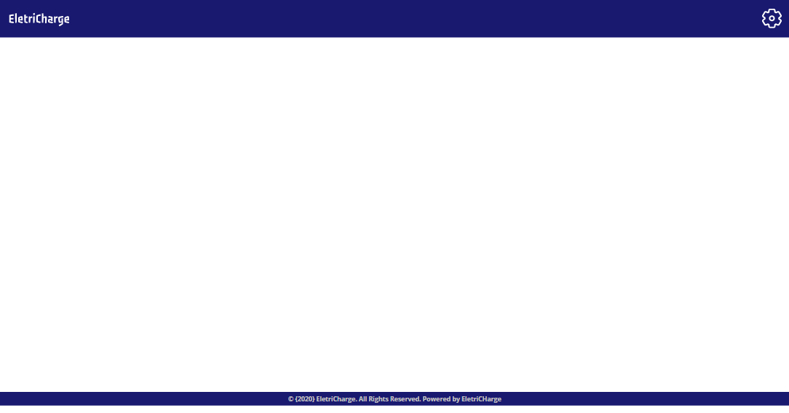

# Template padrão do site

Layout padrão do site (HTML e CSS) que será utilizado em todas as páginas. No canto esquerdo do cabeçalho localiza-se a logotipo do projeto, e no canto direito localiza-se o ícone para o login do administrador. Através do gif é possível notar aspectos de responsividade, como por exemplo, a readequação do rodapé da página.

